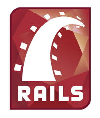
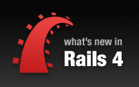
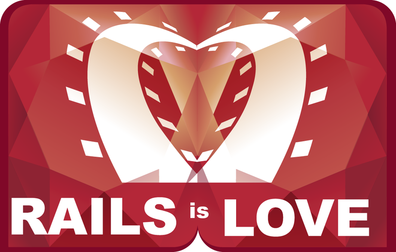

#BEWD - Back End Web Development

###Joe Leo

* Associate Vice President, Credit Suisse
* Instructor, General Assembly
* Rapper, Retired

---

#Why Rails?

---
<aside class="notes">
  While building Basecamp for 37Signals, DHH spotted an opportunity to extract a web development framework for Ruby. He did this in 2004 and made the source code available to the public in 2005.
</aside>

#DHH

* David Heinemeier Hansson, creator of Rails
* Extracted from an existing project
* Released as open source framework in 2005

---
<aside class="notes">
  2005 is when Rails really takes off.
  -- DHH gives "How to build a blog engine in 15 minutes with Ruby on Rails"
  -- Everyone goes bananas
  -- Accolades to follow, including Hacker of the Year honors for DHH
  </aside>

##May 2005: FISL 6.0 Conference

* International Free Software Conference, Porto Alegre, Brazil
* DHH: How to Build a Blog in 15 Minutes
* Rails popularity skyrockets

---

##DEMO
* "Look at all the things I'm _not_ doing!"
* "Look at all the configuration I'm _not_ writing!"
* "It just uses ruby EVERYWHERE."

---

<aside class="notes">
  - as you can see things can go even faster today. 
  - scaffolding, much of directory structure, even some help files remain
  - Twitter Bootstrap, Rails Composer can get you up and running in style
</aside>

##Fast Forward to Rails 4

---

<aside class="notes">
  - DHH didn't have GitHub in 2005. That came along in 2008. 
  - Chris Wanstrath, PJ Hyett, and Tom Preston-Werner
  - A tool that helps ppl collaborate in previously unheard-of ways
  - Build an app in 15 minutes, share it in minutes!
  - (DEMO)
</aside>

##GitHub

---

<aside class="notes">
 - At about the same time, actually in 2007, Heroku was formed
 - James Lindenbaum, Adam Wiggins, and Orion Henry
 - Heroku's first job was to host Ruby on Rails applications
 - take DHH's demo and put it on the World Wide Web easier than ever
 - same as GitHub and Rails, they make things faster, easier, more accessible
 - Build an app in 15 minutes, host it in minutes!
 - (DEMO)
</aside>

---
<aside class="notes">
  Being able to build things quickly means getting it in front of your audience quickly
  - try things out
  - quickly find out what works and what doesn't
  - pivot, iterate fast

  Be Test Driven - don't just think your code works, _prove_ that it works
</aside>

##Keys to Rails Success

* Ruby!
* Fail Fast / Succeed Faster
* Be More Agile (??)
* Make Testing the Norm

---
<aside class="notes">
  Community
  - Dave Thomas makes Ruby popular in the US
  - Still the best supported community I know
  - Where do you fit in?
  - Only you can answer; if you want in, I can help
</aside>

#Keys to Rails Success

  * The Ruby Community 
  * David Black, Dave Thomas, Chad Fowler
  * MINASAW
  * YOU
