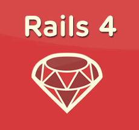
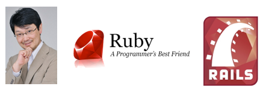

#BEWD - Back End Web Development

###Joe Leo

* Associate Vice President, Credit Suisse
* www.TestDrivenDomination.com
* Twitter / GitHub / LinkedIn: @jleo3

---

#Why Rails?

---
<aside class="notes">
  While building Basecamp for 37Signals, DHH spotted an opportunity to extract a web development framework for Ruby. He did this in 2004 and made the source code available to the public in 2005.
</aside>

#DHH

* David Heinemeier Hansson, creator of Rails
* Extracted from an existing project
* Released as open source framework in 2005

---
<aside class="notes">
  2005 is when Rails really takes off.
  -- DHH gives "How to build a blog engine in 15 minutes with Ruby on Rails"
  -- Available on YouTube - interesting history lesson
  -- Everyone goes bananas - fast, sleek, uses this great looking language - Ruby
  -- Accolades to follow, including Hacker of the Year honors from Google, O'Reilly
  </aside>

##May 2005: FISL 6.0 Conference

* International Free Software Conference, Porto Alegre, Brazil
* DHH: How to Build a Blog in 15 Minutes
* Rails popularity skyrockets

---

<aside class="notes">
  -- take you back to 2005
  -- perform the same steps that DHH did in his talk
</aside>

##DEMO
* "Look at all the things I'm _not_ doing!"
* "Look at all the configuration I'm _not_ writing!"
* "It just uses ruby EVERYWHERE."

---

<aside class="notes">
  - David went on to show testing, and making the blog better looking
  - but lots of scaffolding, much of directory structure, even some help files remain
  - Twitter Bootstrap, Rails Composer can get you up and running in style
</aside>

##Fast Forward to Rails 4

---

<aside class="notes">
  - DHH didn't have GitHub in 2005. That came along in 2008. 
  - Chris Wanstrath, PJ Hyett, and Tom Preston-Werner
  - A tool that helps ppl collaborate in previously unheard-of ways
  - Build an app in 15 minutes, share it in minutes!
  - (DEMO)
</aside>

##GitHub

---

<aside class="notes">
 - At about the same time, actually in 2007, Heroku was formed
 - James Lindenbaum, Adam Wiggins, and Orion Henry
 - Heroku's first job was to host Ruby on Rails applications
 - Bought for 212mm, started with RoR 
 - take DHH's demo and put it on the World Wide Web easier than ever
 - same as GitHub and Rails, they make things faster, easier, more accessible
 - Build an app in 15 minutes, host it in minutes!
 - (DEMO)
</aside>

---
<aside class="notes">
  Being able to build things quickly means getting it in front of your audience quickly
  - try things out
  - quickly find out what works and what doesn't
  - pivot, iterate fast
  - the reason there are so many startups, and ppl fund what's basically just an idea 
  - developers, using these tools, can go from idea to working application in a snap
</aside>

##Keys to Rails Success

* Iterate with your customers
* Fail Fast / Succeed Faster

---
<aside class="notes">
  Community
  - Ruby is a beautiful language with the most active, supportive community, likely in history
  - MINASWAN - Matz, creator of Ruby
  - Matz is a really nice guy - gets involved, tries to grow his language
  - Dave Thomas, Chad Fowler bring Ruby to US, make it more popular
  - Sandi Metz, James Edward Gray who carry the torch
  - This class is one way that I fit in
  - Where do you fit in?
  - Only you can answer; 
  - I'll say this: We're talking about something exciting, cutting edge, and the present and future of application development
  - If you want to be a part of it, I can help
</aside>

#Keys to Rails Success

  * Ruby!
  * The Ruby Community 
  * MINASWAN
  * David Black, Dave Thomas, Chad Fowler
  * Sandi Metz, James Edward Gray
  * YOU
